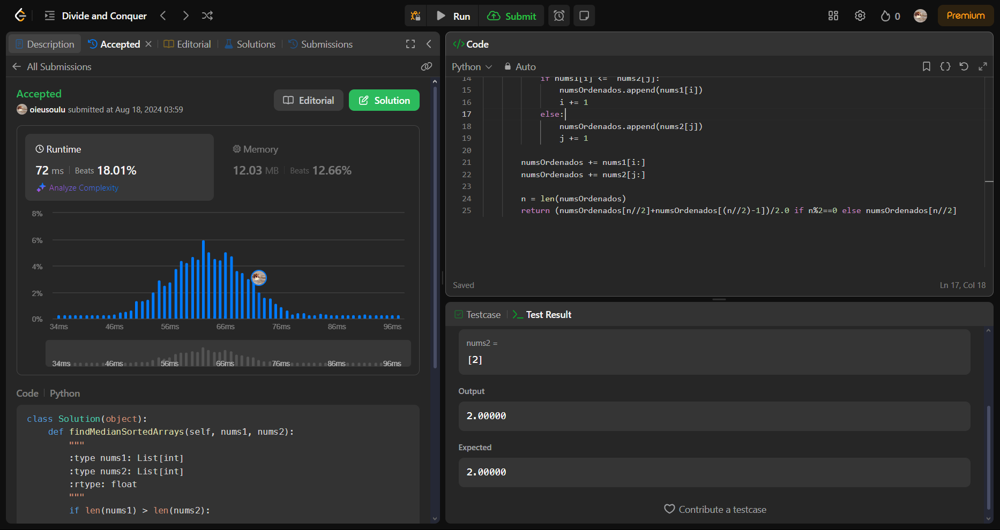
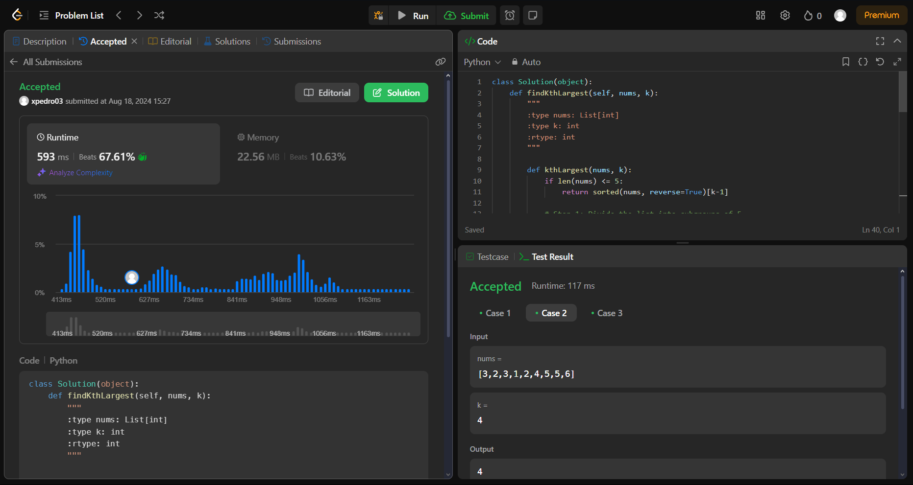
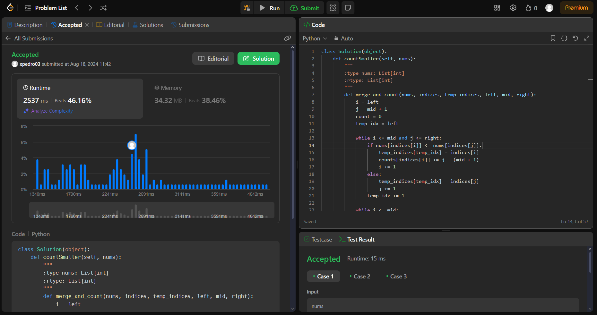
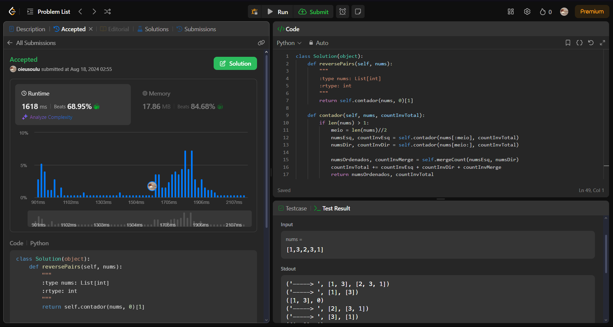

# LeetJudge

**Número da Lista**: 10 
**Conteúdo da Disciplina**: Dividir e Conquistar 

## Alunos
| Matrícula  | Aluno                           |
| ---------- | ------------------------------- |
| 22/1007653 | Luciano Ricardo da Silva Junior |
| 21/1031468 | Pedro Victor Salerno Martins    |

## Sobre 
Resolver duas questões dificeis e duas media utilizando os conceitos de Dividir e Conquistar aprendidos na disciplina de Projetos de Algoritimos da Universidade de Brasilia.

## Video de apresentação
O video de apresentação pode ser encontrado em [link]()

## Screenshots

**Questão 4 após submição**

**Questão XXX após submição**

**Questão 315 após submição**

**Questão 493 após submição**

## Instalação

**Linguagem**: Python 
**Framework**: Não tem 

## Uso

Você pode apenas entrar na questão especifica do juiz virtual e fazer a submição.

As questões são:

- [Questão 4](https://leetcode.com/problems/median-of-two-sorted-arrays/description/)
- [Questão 215](https://leetcode.com/problems/kth-largest-element-in-an-array/)
- [Questão 315](https://leetcode.com/problems/count-of-smaller-numbers-after-self/description/)
- [Questão 493](https://leetcode.com/problems/reverse-pairs/description/)

Alternativamente você pode ter o Python instalado e executar os arquivos de teste.
